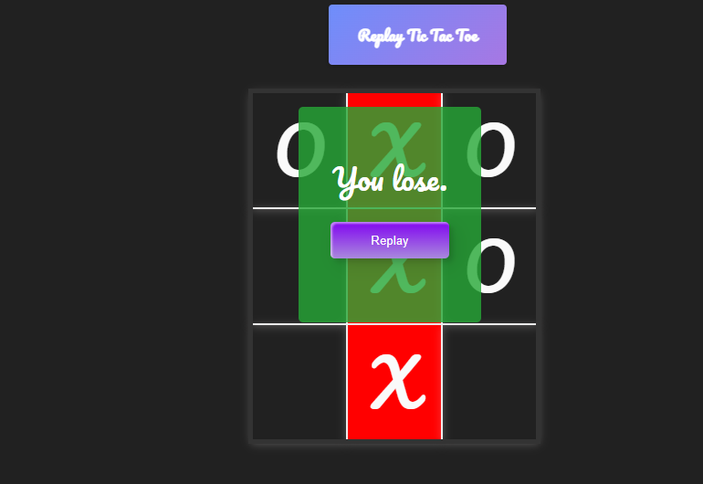

# Tic Tac Toe Game

## Overview

Tic Tac Toe is a classic game enjoyed by people of all ages. This web-based implementation offers a delightful way to play the game either against a friend or against an AI opponent.

## Features

- **Single Player and Multiplayer Modes**: Choose to play against a friend or challenge the computer AI.
- **Interactive Gameplay**: Click on the grid to make your move and enjoy smooth gameplay.
- **Beautiful Design**: The game features a visually appealing user interface with pleasant colors and animations.
- **Replay Option**: After each game, players have the option to replay without reloading the page.
- **Responsive Design**: Play the game seamlessly on both desktop and mobile devices.

## How to Play

1. Open the `index.html` file in a web browser.
2. Choose your mode: "Player vs Player" or "Player vs AI".
3. Click on any cell in the grid to make your move.
4. Try to get three of your marks in a row horizontally, vertically, or diagonally to win the game.
5. If you're playing against the computer, try to outsmart it to win!

## Files

- `index.html`: Contains the HTML structure of the game.
- `style.css`: Stylesheet for the game's appearance.
- `script.js`: JavaScript code for game logic and interactivity.

## Preview

## Contact

For any inquiries or feedback, feel free to reach out to us at [your-email@example.com](mailto:your-email@example.com).

## Credits

This project was created by [Your Name].

## License

This project is licensed under the [MIT License](LICENSE).
